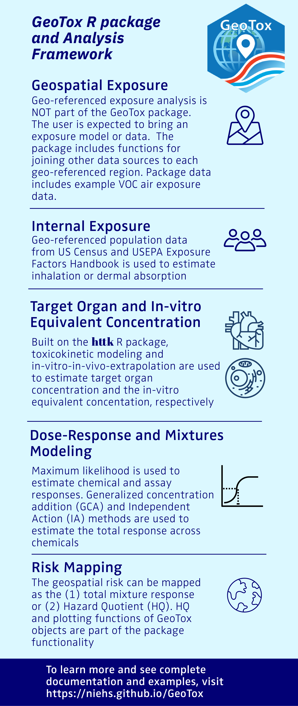

<!-- README.md is generated from README.Rmd. Please edit that file -->

```{r, include = FALSE}
knitr::opts_chunk$set(
  collapse = TRUE,
  comment = "#>",
  fig.path = "man/figures/README-",
  out.width = "100%"
)
```

# GeoTox <a href="https://github.com/NIEHS/GeoTox"></a>

<!-- badges: start -->

[](https://www.repostatus.org/#active)
[](https://github.com/NIEHS/GeoTox/actions/workflows/R-CMD-check.yaml)
[](https://github.com/NIEHS/GeoTox/actions/workflows/pkgdown.yaml)
[](https://github.com/NIEHS/GeoTox/actions)
[](https://CRAN.R-project.org/package=GeoTox)

<!-- badges: end -->

`GeoTox` open-source R software package for characterizing the risk of perturbing molecular targets involved in adverse human health outcomes based on exposure to spatially-referenced stressor mixtures via the GeoTox framework - otherwise known as source-to-outcome-continuum modeling. The package, methods, and case-studies are described in [Messier, Reif, and Marvel, 2024, medRxiv-Preprint](https://www.medrxiv.org/content/10.1101/2024.09.23.24314096).

The GeoTox framework was first described in
[Eccles et al. A geospatial modeling approach to quantifying the risk of exposure to environmental chemical mixtures via a common molecular target. Sci Total Environ. 2023 Jan 10;855:158905.](https://pubmed.ncbi.nlm.nih.gov/36152849/)

## Installation

```{r, eval=FALSE}
install.packages("GeoTox")
```

## Development Version

The development version can be installed from GitHub.

```{r, eval=FALSE}
#install.packages("pak")
pak::pak("NIEHS/GeoTox")
```

## Overview

Figure 1 below shows the steps in the source-to-outcome-continuum or GeoTox modeling framework that is capable in the `GeoTox` package. <span style="color: blue;">blue text</span> nodes represent an object and <span style="color: green;">green text</span>, rounded nodes represent a methodology or function required to go from one to the next. The `GeoTox` package uses R S3 object-oriented programming to create the **GeoTox** object. The **GeoTox** object is a list that contains all of the information required to run the analysis including tracking exposure, assays, dose-response, and geospatial referencing. 

<p align="center">
  
  <br>
  <em>Figure 1: Overview of the steps in the GeoTox framework</em>
</p>

## Getting Started

Please refer to the [introduction vignette](https://niehs.github.io/GeoTox/articles/introduction.html) for a detailed description of how to use `GeoTox`.

## Citation 

For citation information, please refer to our [CITATION file](inst/CITATION).

## Issues and Contributions

To add or edit functionality, open a pull request into the main branch with a detailed description of the proposed changes. Pull requests must pass all status checks, and then will be approved or rejected by the GeoTox maintainers.

Utilize [GitHub issues](https://github.com/NIEHS/GeoTox/issues) to notify the authors of bugs, questions, or recommendations. Identify each issue with the appropriate label to help ensure a timely response.

