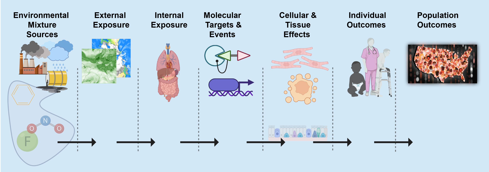

<!-- README.md is generated from README.Rmd. Please edit that file -->

```{r, include = FALSE}
knitr::opts_chunk$set(
  collapse = TRUE,
  comment = "#>",
  fig.path = "man/figures/README-",
  out.width = "100%"
)
```

# GeoTox <a href="https://niehs.github.io/GeoTox/"></a>


<!-- badges: start -->

[](https://github.com/NIEHS/GeoTox/actions/workflows/check-release.yaml)
[](https://github.com/NIEHS/GeoTox/actions)
[](https://www.repostatus.org/#wip)
[](https://CRAN.R-project.org/package=GeoTox)

<!-- badges: end -->


`GeoTox` open-source R software package for characterizing the risk of perturbing molecular targets involved in adverse human health outcomes based on exposure to spatially-referenced stressor mixtures. The original framework is described in

[Eccles KM, Karmaus AL, Kleinstreuer NC, Parham F, Rider CV, Wambaugh JF, Messier KP. A geospatial modeling approach to quantifying the risk of exposure to environmental chemical mixtures via a common molecular target. Sci Total Environ. 2023 Jan 10;855:158905. doi: 10.1016/j.scitotenv.2022.158905. Epub 2022 Sep 21. PMID: 36152849; PMCID: PMC9979101.](https://pubmed.ncbi.nlm.nih.gov/36152849/)

`GeoTox` package represents a significant advancement in environmental risk characterization, providing modular software to facilitate the application and further development of the GeoTox framework for quantifying the relationship between environmental exposures and health outcomes. By integrating geospatial methods with cutting-edge exposure and toxicological frameworks, `GeoTox` offers a robust tool for assessing individual and population-level risks from environmental stressors. 



## Installation

The package will be on CRAN in the near future - please stay tuned. You can install the development version of GeoTox from
[GitHub](https://github.com/) with:

```{r, eval=FALSE}
if (!require("pak", quietly = TRUE)) {
  install.packages("pak")
}
pak::pkg_install("NIEHS/GeoTox")
```
