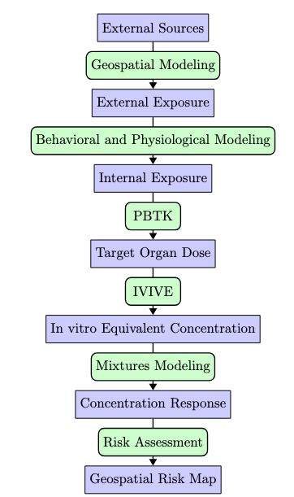

<!-- README.md is generated from README.Rmd. Please edit that file -->

# GeoTox <a href="https://niehs.github.io/GeoTox/"></a>

<!-- badges: start -->

[](https://github.com/NIEHS/GeoTox/actions/workflows/check-release.yaml)
[](https://github.com/NIEHS/GeoTox/actions)
[](https://www.repostatus.org/#wip)
[](https://CRAN.R-project.org/package=GeoTox)

<!-- badges: end -->

`GeoTox` open-source R software package for characterizing the risk of
perturbing molecular targets involved in adverse human health outcomes
based on exposure to spatially-referenced stressor mixtures. The
original framework is described in

[Eccles KM, Karmaus AL, Kleinstreuer NC, Parham F, Rider CV, Wambaugh
JF, Messier KP. A geospatial modeling approach to quantifying the risk
of exposure to environmental chemical mixtures via a common molecular
target. Sci Total Environ. 2023 Jan 10;855:158905. doi:
10.1016/j.scitotenv.2022.158905. Epub 2022 Sep 21. PMID: 36152849;
PMCID: PMC9979101.](https://pubmed.ncbi.nlm.nih.gov/36152849/)

`GeoTox` package represents a significant advancement in environmental
risk characterization, providing modular software to facilitate the
application and further development of the GeoTox framework for
quantifying the relationship between environmental exposures and health
outcomes. By integrating geospatial methods with cutting-edge exposure
and toxicological frameworks, `GeoTox` offers a robust tool for
assessing individual and population-level risks from environmental
stressors.

 Toxic effects are mediated
through chemicals that alter critical molecules, cells, and
physiological processes inside the body. In the same spirit, it is clear
that phenotypic outcomes (e.g. disease) at the individual or population
level can only occur after a series of source, exposure, and biological
dynamics. We refer to this as the **source-to-outcome-continuum**. It
follows that if methods and data exist to quantify each step in the
sequence, and each step can be integrated into each neighboring step,
then individual and population outcomes can be quantified from
spatiotemporally resolved environmental sources and exposures.

<p align="center">
 <br>
<em>Figure: GeoTox Workflow</em>
</p>

Flowchart of the GeoTox Framework. <span style="color: blue;">blue
text</span> nodes represent an object and <span
style="color: green;">green text</span>, rounded nodes represent a
methodology or function required to go from one to the next.

## Installation

The package will be on CRAN in the near future - please stay tuned. You
can install the development version of GeoTox from
[GitHub](https://github.com/) with:

``` r
if (!require("pak", quietly = TRUE)) {
  install.packages("pak")
}
pak::pkg_install("NIEHS/GeoTox")
```
