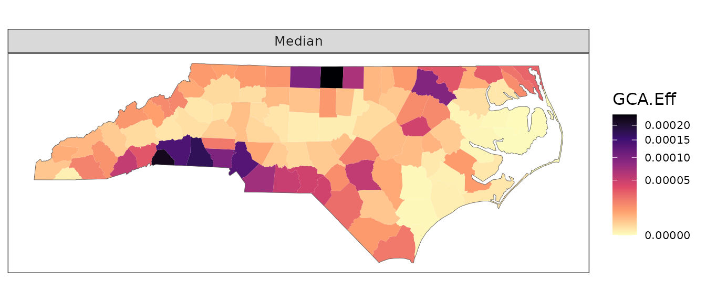
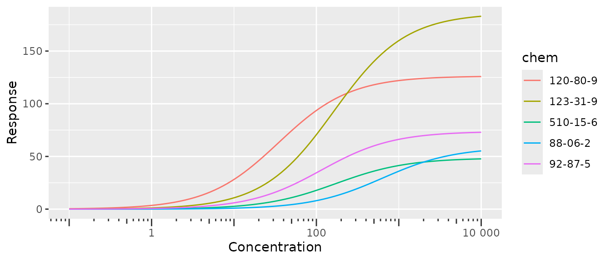
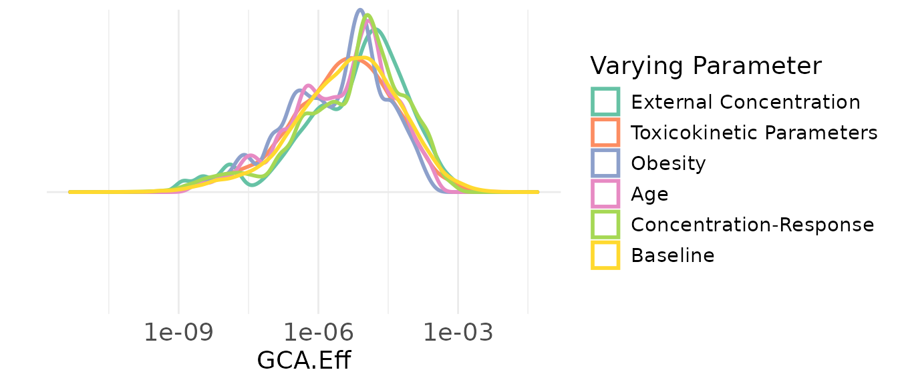
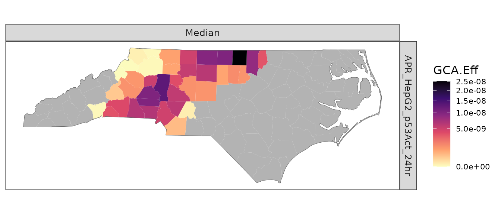
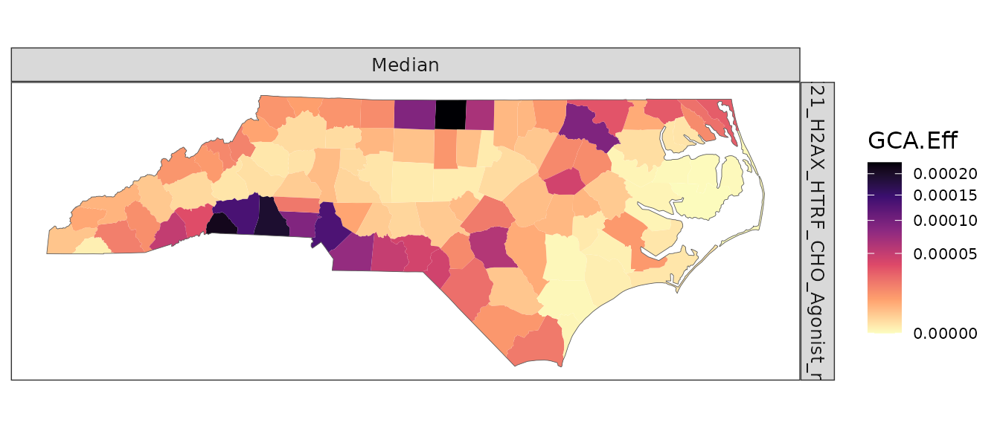
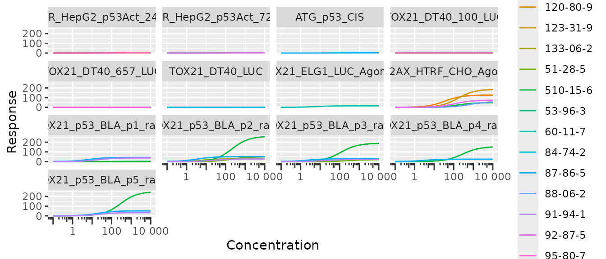
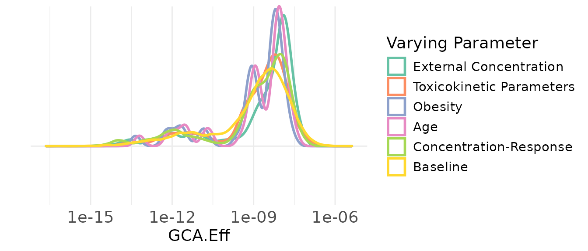
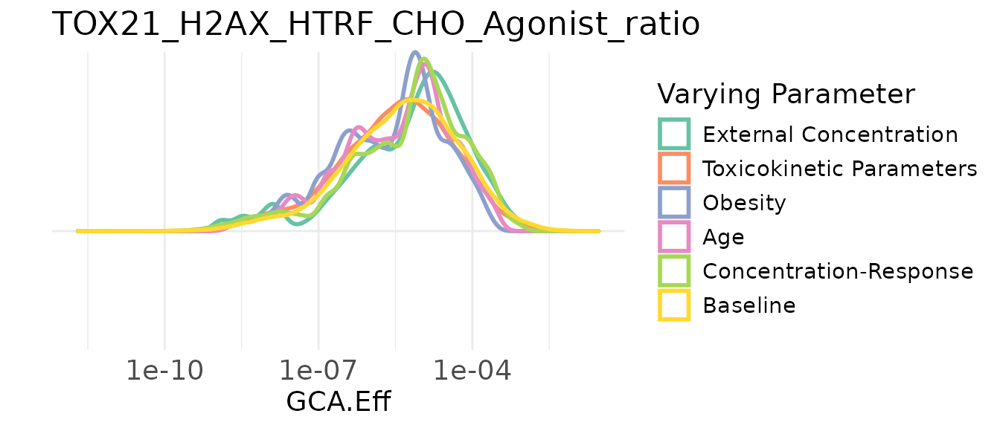
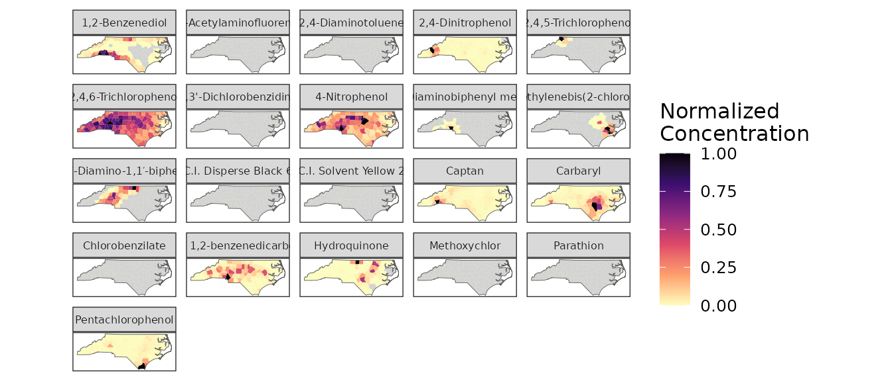

# GeoTox Introduction

This vignette covers basic use of package functions. Package data,
`geo_tox_data`, is used throughout the examples and details on how it
was created can be found in the “GeoTox Package Data” vignette.

``` r
library(GeoTox)
library(dplyr)

n <- 250 # Sample size
```

> **NOTE:** The sample size here is the size of the simulated population
> in each region. This is different than the sample size in the
> “package_data” vignette, which is used to generate `C_ss` values for
> each chemical at specified age and weight combinations.

## Analysis of single assay

Create GeoTox object, run simulations and computations

``` r
set.seed(2357)
geoTox <- GeoTox() |> 
  # Set region and group boundaries (for plotting)
  set_boundaries(region = geo_tox_data$boundaries$county,
                 group  = geo_tox_data$boundaries$state) |> 
  # Simulate populations for each region
  simulate_population(age           = split(geo_tox_data$age, ~FIPS),
                      obesity       = geo_tox_data$obesity,
                      exposure      = split(geo_tox_data$exposure, ~FIPS),
                      simulated_css = geo_tox_data$simulated_css,
                      n             = n) |> 
  # Estimated Hill parameters
  set_hill_params(geo_tox_data$dose_response |>
                    filter(endp == "TOX21_H2AX_HTRF_CHO_Agonist_ratio") |>
                    fit_hill(chem = "casn") |> 
                    filter(!tp.sd.imputed, !logAC50.sd.imputed)) |>
  # Calculate response
  calculate_response() |>
  # Perform sensitivity analysis
  sensitivity_analysis()

geoTox
#> GeoTox object
#> Assays: 1
#> Chemicals: 5
#> Regions: m = 100
#> Population: n = 250
#> Data Fields:
#>      Name          Size
#>       age       m * (n)
#>        IR       m * (n)
#>   obesity       m * (n)
#>     C_ext  m * (n x 21)
#>      C_ss  m * (n x 21)
#> Computed Fields:
#>          Name                   Size
#>         D_int           m * (n x 21)
#>     C_invitro           m * (n x 21)
#>          resp        m * (1 * n x 5)
#>   sensitivity  5 * (m * (1 * n x 5))
#> Other Fields: par, boundaries, exposure, css_sensitivity, hill_params
```

Plot outputs

``` r
plot(geoTox)
```



``` r
plot(geoTox, type = "hill")
```



``` r
plot(geoTox, type = "sensitivity")
#> Picking joint bandwidth of 0.131
```



## Analysis of multiple assay

Create GeoTox object, run simulations and computations

``` r
set.seed(2357)
geoTox <- GeoTox() |> 
  # Set region and group boundaries (for plotting)
  set_boundaries(region = geo_tox_data$boundaries$county,
                 group  = geo_tox_data$boundaries$state) |> 
  # Simulate populations for each region
  simulate_population(age           = split(geo_tox_data$age, ~FIPS),
                      obesity       = geo_tox_data$obesity,
                      exposure      = split(geo_tox_data$exposure, ~FIPS),
                      simulated_css = geo_tox_data$simulated_css,
                      n             = n) |> 
  # Estimated Hill parameters
  set_hill_params(geo_tox_data$dose_response |>
                    fit_hill(assay = "endp", chem = "casn") |> 
                    filter(!tp.sd.imputed, !logAC50.sd.imputed)) |>
  # Calculate response
  calculate_response() |>
  # Perform sensitivity analysis
  sensitivity_analysis()

geoTox
#> GeoTox object
#> Assays: 13
#> Chemicals: 15
#> Regions: m = 100
#> Population: n = 250
#> Data Fields:
#>      Name          Size
#>       age       m * (n)
#>        IR       m * (n)
#>   obesity       m * (n)
#>     C_ext  m * (n x 21)
#>      C_ss  m * (n x 21)
#> Computed Fields:
#>          Name                    Size
#>         D_int            m * (n x 21)
#>     C_invitro            m * (n x 21)
#>          resp        m * (13 * n x 6)
#>   sensitivity  5 * (m * (13 * n x 6))
#> Other Fields: par, boundaries, exposure, css_sensitivity, hill_params
```

Plot outputs

``` r
plot(geoTox)
#> Warning: Multiple assays found, using first assay 'APR_HepG2_p53Act_24hr'
```



``` r
plot(geoTox, assays = "TOX21_H2AX_HTRF_CHO_Agonist_ratio")
```



``` r
plot(geoTox, type = "hill")
```



``` r
plot(geoTox, type = "sensitivity")
#> Warning: Multiple assays found, using first assay 'APR_HepG2_p53Act_24hr'
#> Warning: Removed 93000 NA values
#> Picking joint bandwidth of 0.135
```



``` r
plot(geoTox, type = "sensitivity", assay = "TOX21_H2AX_HTRF_CHO_Agonist_ratio")
#> Picking joint bandwidth of 0.131
```



## Exposure Map

The exposure map is the same for both single and multiple assay
analyses. The map shows the distribution of chemical exposure across
regions for all chemicals, not just those used in a particular analysis.

``` r
plot(geoTox, type = "exposure", ncol = 5)
```


If other facet labels are present they can be specified using the
`chem_label` argument.

``` r
plot(geoTox, type = "exposure", chem_label = "chnm", ncol = 5)
```


