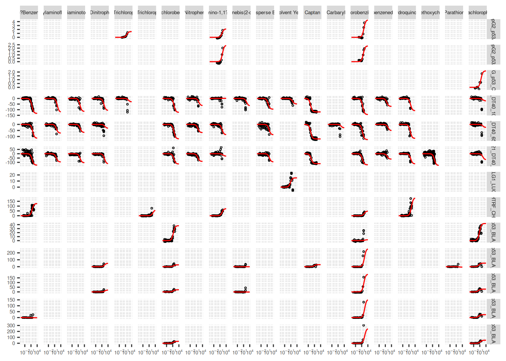
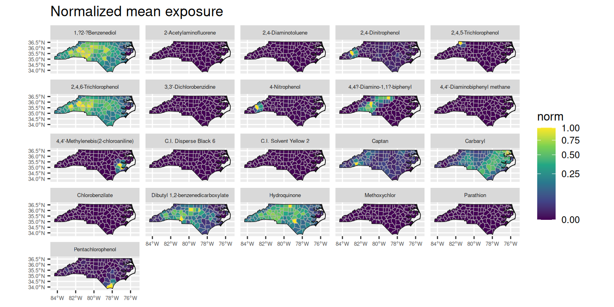
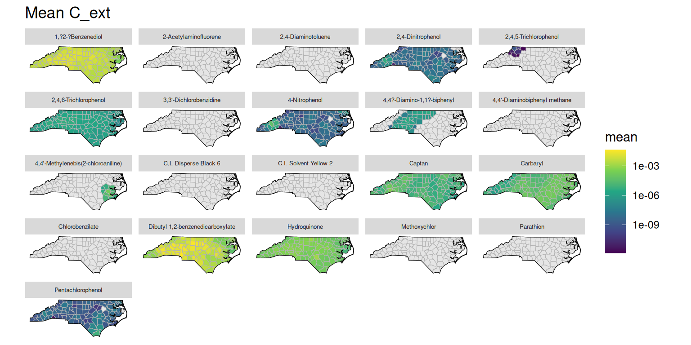
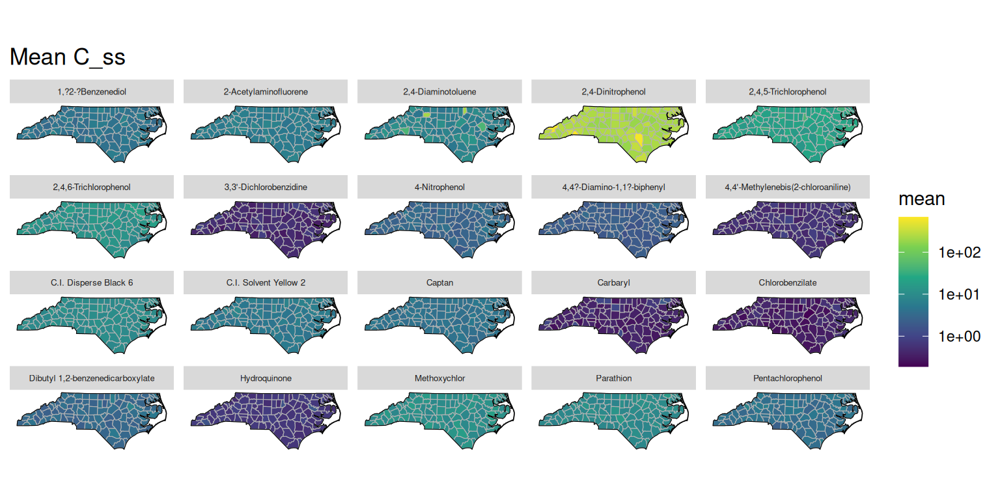
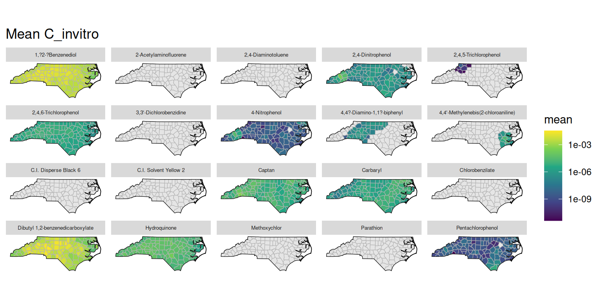
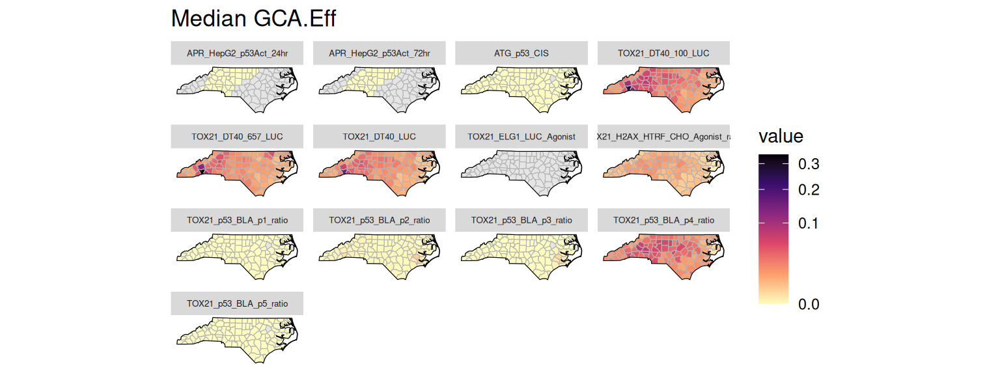
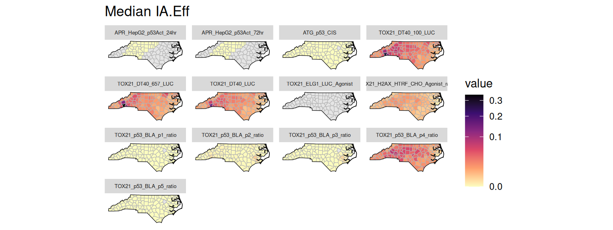
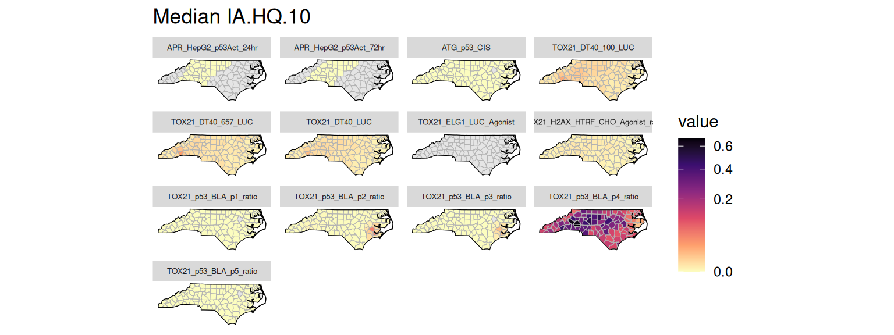
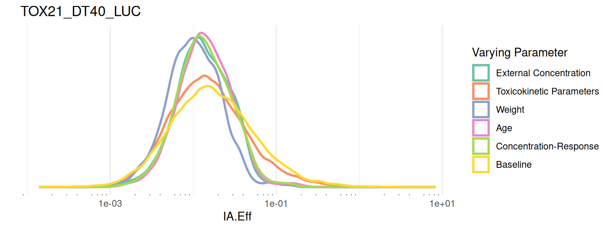

# GeoTox Introduction

This vignette covers basic use of package functions. Package data,
`geo_tox_data`, is used throughout the examples and details on how it
was created can be found in the “GeoTox Package Data” vignette.

## Setup

Load packages and set a seed for reproducibility.

``` r

library(GeoTox)
library(dplyr)
library(ggplot2)
library(purrr)
library(sf)
library(tibble)
library(tidyr)

set.seed(2357)
```

## Hill curve fitting

Hill curve fitting is a key step in the GeoTox workflow, as it provides
the parameters needed to link internal concentrations to assay
responses. The
[`fit_hill()`](https://github.com/NIEHS/GeoTox/dev/reference/fit_hill.md)
function can be used to fit Hill models to dose-response data, and the
resulting parameters can be added to a GeoTox object for use in
subsequent calculations. Dose-reponse data can be grouped by assay and
substance to fit separate Hill curves for each combination.

``` r

hill_params <- fit_hill(
  geo_tox_data$dose_response,
  assay = "endp",
  substance = c("casn", "chnm")
)
hill_params
```

    $fit
    # A tibble: 85 × 16
       endp    casn  chnm      tp   tp.sd logAC50 logAC50.sd slope slope.sd logc_min
       <chr>   <chr> <chr>  <dbl>   <dbl>   <dbl>      <dbl> <dbl>    <dbl>    <dbl>
     1 APR_He… 510-… Chlo…   4.44   5.86     2.06      0.448     1        0   -0.398
     2 APR_He… 92-8… 4,4?…   2.14   0.945    2.05      0.271     1        0   -0.398
     3 APR_He… 95-9… 2,4,…   1.46   0.556    1.67      0.246     1        0   -0.699
     4 APR_He… 510-… Chlo…   2.33   0.542    1.79      0.192     1        0   -0.398
     5 APR_He… 72-4… Meth…   1.93   1.93     1.95      1.95      1        0   -0.398
     6 APR_He… 92-8… 4,4?…   2.43   1.50     2.22      0.317     1        0   -0.398
     7 ATG_p5… 87-8… Pent…   2.15   0.877    1.57      0.321     1        0   -1.30
     8 TOX21_… 100-… 4-Ni… -63.4   94.6      2.18      0.784     1        0   -3
     9 TOX21_… 101-… 4,4'… -65.6  169.       2.45      1.04      1        0   -3
    10 TOX21_… 119-… C.I.… -95.5   18.6      1.45      0.175     1        0   -3
    # ℹ 75 more rows
    # ℹ 6 more variables: logc_max <dbl>, resp_min <dbl>, resp_max <dbl>,
    #   AIC <dbl>, tp.sd.imputed <lgl>, logAC50.sd.imputed <lgl>

    $assay
    [1] "endp"

    $substance
    [1] "casn" "chnm"

Sometimes the standard deviation estimates may be missing. In these
cases,
[`fit_hill()`](https://github.com/NIEHS/GeoTox/dev/reference/fit_hill.md)
will impute missing standard deviations with the corresponding parameter
estimate. If this is not desirable, the imputed standard deviations can
be identified using the `tp.sd.imputed` and `logAC50.sd.imputed` columns
of the resulting object’s `fit` table, and these fits can be removed.

``` r

hill_params$fit <- hill_params$fit |>
  filter(!tp.sd.imputed, !logAC50.sd.imputed)
```

The resulting Hill curves can be visualized by plotting the fitted
curves along with the original dose-response points.

``` r

ggplot() +
  # Add original dose-response points
  geom_point(
    data = geo_tox_data$dose_response |>
      semi_join(hill_params$fit, by = c("endp", "chnm")),
    aes(x = 10^logc, y = resp),
    pch = 1,
    size = 0.5
  ) +
  # Add Hill curves
  pmap(
    hill_params$fit |> select(endp, chnm, tp, logAC50, slope),
    \(endp, chnm, tp, logAC50, slope) {
      geom_function(
        data = tibble(endp = endp, chnm = chnm),
        fun = \(x, tp, logAC50, slope) {
          tp / (1 + (10^logAC50 / x)^slope)
        },
        args = list(tp = tp, logAC50 = logAC50, slope = slope),
        color = "red"
      )
    }
  ) +
  # Format
  facet_grid(endp ~ chnm, scales = "free_y") +
  scale_x_log10(
    limits = c(1e-4, 1e4),
    labels = scales::label_log()
  ) +
  theme(
    axis.title = element_blank(),
    axis.text = element_text(size = 5),
    strip.text = element_text(size = 5)
  )
```



## Workflow steps

There are three main steps to the GeoTox workflow: creating a GeoTox
object and setting various data components, simulating population
characteristics and exposure, and calculating risk scores.

### Create a GeoTox object

Creating a GeoTox object requires providing a path to a DuckDB database
file. This can be an existing file or a new file that will be created.
There are several components that can be set once the object is created.

- [`set_boundary()`](https://github.com/NIEHS/GeoTox/dev/reference/set_boundary.md):
  (optional) Store spatial boundary data as a `BLOB` in the database.
  The boundary data can be retrieved later using
  [`get_boundary()`](https://github.com/NIEHS/GeoTox/dev/reference/set_boundary.md)
  and used for visualization.
- [`set_simulated_css()`](https://github.com/NIEHS/GeoTox/dev/reference/set_simulated_css.md):
  Store pre-simulated steady-state plasma concentration data as a table
  in the database. These values are used by
  [`sample_simulated_css()`](https://github.com/NIEHS/GeoTox/dev/reference/sample_simulated_css.md)
  (or the wrapper function
  [`simulate_population()`](https://github.com/NIEHS/GeoTox/dev/reference/simulate_population.md)).
- [`add_exposure_rate_params()`](https://github.com/NIEHS/GeoTox/dev/reference/add_exposure_rate_params.md):
  Add parameters needed to simulate exposure rates for specific routes,
  e.g. inhalation. These parameters are used by
  [`simulate_exposure_rate()`](https://github.com/NIEHS/GeoTox/dev/reference/simulate_exposure_rate.md)
  (or the wrapper function
  [`simulate_population()`](https://github.com/NIEHS/GeoTox/dev/reference/simulate_population.md)).
- [`add_hill_params()`](https://github.com/NIEHS/GeoTox/dev/reference/add_hill_params.md):
  Add parameters from Hill curve fitting to the database. These
  parameters are used by
  [`calc_risk()`](https://github.com/NIEHS/GeoTox/dev/reference/calc_risk.md)
  (or the wrapper function
  [`calc_response()`](https://github.com/NIEHS/GeoTox/dev/reference/calc_response.md)).

``` r

GT <- GeoTox("GeoTox-introduction.duckdb") |>
  set_boundary(geo_tox_data$boundaries) |>
  set_simulated_css(geo_tox_data$simulated_css) |>
  add_exposure_rate_params() |>
  add_hill_params(hill_params)
```

### Simulate a population

Population characteristics (age and obesity status) and exposure can be
simulated using the
[`simulate_population()`](https://github.com/NIEHS/GeoTox/dev/reference/simulate_population.md)
function, which is a wrapper around
[`simulate_age()`](https://github.com/NIEHS/GeoTox/dev/reference/simulate_age.md),
[`simulate_obesity()`](https://github.com/NIEHS/GeoTox/dev/reference/simulate_obesity.md),
[`simulate_exposure_rate()`](https://github.com/NIEHS/GeoTox/dev/reference/simulate_exposure_rate.md),
and
[`simulate_exposure()`](https://github.com/NIEHS/GeoTox/dev/reference/simulate_exposure.md).
Alternatively,
[`set_sample()`](https://github.com/NIEHS/GeoTox/dev/reference/set_sample.md)
can be used for age and/or obesity status. The resulting simulated data
is stored in the database and used for subsequent calculations. In
addition,
[`simulate_population()`](https://github.com/NIEHS/GeoTox/dev/reference/simulate_population.md)
will sample steady-state plasma concentrations from the pre-simulated
data using
[`sample_simulated_css()`](https://github.com/NIEHS/GeoTox/dev/reference/sample_simulated_css.md),
and
[`set_fixed_css()`](https://github.com/NIEHS/GeoTox/dev/reference/set_fixed_css.md)
will be called in preparation for sensitivity analysis.

``` r

GT <- GT |> 
  simulate_population(
    age       = geo_tox_data$age,
    obesity   = geo_tox_data$obesity,
    exposure  = geo_tox_data$exposure |> mutate(route = "inhalation"),
    substance = c("casn", "chnm"),
    n         = 150
  )
```

### Calculate risk

Risk scores can be calculated using the
[`calc_response()`](https://github.com/NIEHS/GeoTox/dev/reference/calc_response.md)
function, which is a wrapper around
[`calc_internal_dose()`](https://github.com/NIEHS/GeoTox/dev/reference/calc_internal_dose.md),
[`calc_invitro_concentration()`](https://github.com/NIEHS/GeoTox/dev/reference/calc_invitro_concentration.md),
and
[`calc_risk()`](https://github.com/NIEHS/GeoTox/dev/reference/calc_risk.md).
Sensitivity analysis can then be performed using
[`sensitivity_analysis()`](https://github.com/NIEHS/GeoTox/dev/reference/sensitivity_analysis.md).

``` r

GT <- GT |> 
  calc_response() |> 
  sensitivity_analysis()
```

## Results

An overview of the GeoTox object can be obtained by printing it.

``` r

GT
```

    GeoTox object
    Database info:
      dbdir: GeoTox-introduction.duckdb
    Reset seed: FALSE
    Assays: 13
    Substances: 22
    Locations: 100
    Population: 150
    Concentrations: C_ext, C_ss, D_int, C_invitro
    Risk: GCA.Eff, IA.Eff, GCA.HQ.10, IA.HQ.10
    Sensitivity: C_ext, age, css_params, fit_params, weight

Connecting to the database allows access to the various tables that
store the data used in the workflow.

``` r

con <- get_con(GT)
DBI::dbListTables(con)
```

     [1] "age"                         "assay"
     [3] "boundary"                    "concentration"
     [5] "exposure"                    "exposure_rate"
     [7] "exposure_rate_params"        "fixed_css"
     [9] "hill_params"                 "location"
    [11] "obesity"                     "par"
    [13] "risk"                        "risk_sensitivity_C_ext"
    [15] "risk_sensitivity_age"        "risk_sensitivity_css_params"
    [17] "risk_sensitivity_fit_params" "risk_sensitivity_weight"
    [19] "route"                       "sample"
    [21] "simulated_css"               "substance"                  

``` r

DBI::dbDisconnect(con)
```

Below are the tables that exist after performing sensitivity analysis on
the example dataset.


There are several helper functions for fetching data from the database
for use in visualization. Geographical boundary data can be retrieved
using
[`get_boundary()`](https://github.com/NIEHS/GeoTox/dev/reference/set_boundary.md)
and combined with these other helper functions for plotting.

### Exposure

Exposure data was added to the database using
[`simulate_population()`](https://github.com/NIEHS/GeoTox/dev/reference/simulate_population.md),
which calls
[`add_exposure()`](https://github.com/NIEHS/GeoTox/dev/reference/add_exposure.md)
and
[`simulate_exposure()`](https://github.com/NIEHS/GeoTox/dev/reference/simulate_exposure.md).
The input data used to simulate exposure values is stored in the
`exposure` table and can be joined with the `substance` table to
retrieve any entered chemical information. Below is an example of
plotting the normalized mean exposure by county and chemical name.

``` r

plot_exposure <- function(GT) {
  con <- get_con(GT)
  withr::defer(DBI::dbDisconnect(con))

  boundary <- GT |> get_boundary() |> deframe()

  df <- tbl(con, "exposure") |>
    left_join(tbl(con, "substance"), by = join_by(substance_id == id)) |>
    collect() |>
    left_join(boundary$county, by = join_by(location_id)) |>
    sf::st_as_sf()

  ggplot(df) +
    geom_sf(aes(fill = norm), color = "grey70") +
    facet_wrap(vars(chnm)) +
    geom_sf(data = boundary$state, fill = NA, color = "black") +
    scale_fill_viridis_c(transform = "sqrt") +
    theme(
      axis.text = element_text(size = 5),
      strip.text = element_text(size = 5)
    ) +
    ggtitle("Normalized mean exposure")
}

plot_exposure(GT)
```



### Concentrations

Various concentration fields are stored in the `concentration` table.
The helper function
[`get_concentration_mean()`](https://github.com/NIEHS/GeoTox/dev/reference/get_concentration_mean.md)
can be used to fetch the mean values for a given concentration field,
grouped by substance, route, and location. The concentration data can
then be plotted similarly to the exposure data. Below are examples of
plotting the mean external concentration (`C_ext`), steady-state plasma
concentration (`C_ss`), internal dose (`D_int`), and *in vitro*
concentration (`C_invitro`) by county and chemical name.

``` r

plot_concentration_mean <- function(GT, col, wrap_var = "chnm") {
  con <- get_con(GT)
  withr::defer(DBI::dbDisconnect(con))

  boundary <- GT |> get_boundary() |> deframe()

  # Substance data for joining chemical names
  substance_df <- tbl(con, "substance") |> collect()

  df <- get_concentration_mean(GT, col) |>
    mutate(mean = if_else(mean == 0, NA, mean)) |>
    left_join(substance_df, by = join_by(substance_id == id)) |>
    left_join(boundary$county, by = join_by(location_id)) |>
    sf::st_as_sf()

  ggplot(df) +
    geom_sf(aes(fill = mean), color = "grey70") +
    facet_wrap(vars(.data[[wrap_var]])) +
    geom_sf(data = boundary$state, fill = NA, color = "black") +
    scale_fill_viridis_c(
      transform = "log10",
      na.value = "grey90"
    ) +
    theme(
      axis.text = element_blank(),
      axis.ticks = element_blank(),
      panel.background = element_blank(),
      panel.grid = element_blank(),
      strip.text = element_text(size = 5)
    ) +
    ggtitle(paste("Mean", col))
}

plot_concentration_mean(GT, "C_ext")
```

    The duckplyr package is configured to fall back to dplyr when it encounters an
    incompatibility. Fallback events can be collected and uploaded for analysis to
    guide future development. By default, data will be collected but no data will
    be uploaded.
    ℹ Automatic fallback uploading is not controlled and therefore disabled, see
      `?duckplyr::fallback()`.
    ✔ Number of reports ready for upload: 1.
    → Review with `duckplyr::fallback_review()`, upload with
      `duckplyr::fallback_upload()`.
    ℹ Configure automatic uploading with `duckplyr::fallback_config()`.



``` r

plot_concentration_mean(GT, "C_ss")
```



``` r

plot_concentration_mean(GT, "D_int")
```


``` r

plot_concentration_mean(GT, "C_invitro")
```



### Risk

Several risk metrics are stored in the `risk` table. The helper function
[`get_risk_quantiles()`](https://github.com/NIEHS/GeoTox/dev/reference/get_risk_values.md)
can be used to fetch quantiles of these risk metrics grouped by assay
and location. Below are examples of plotting the median values for the
generalized concentration addition (GCA) and independent action (IA)
efficacy risk scores and the hazard quotients using the 10% effective
concentration (HQ.10).

``` r

plot_risk_quantile <- function(
    GT, col, wrap_var = "endp", quantiles = c("Median" = 0.5)
) {
  con <- get_con(GT)
  withr::defer(DBI::dbDisconnect(con))

  boundary <- GT |> get_boundary() |> deframe()

  # Assay data for joining assay names
  assay_df <- tbl(con, "assay") |> collect()

  df <- get_risk_quantiles(GT, col, quantiles) |>
    left_join(assay_df, by = join_by(assay_id == id)) |>
    left_join(boundary$county, by = join_by(location_id)) |>
    sf::st_as_sf()

  ggplot(df) +
    geom_sf(aes(fill = value), color = "grey70") +
    facet_wrap(vars(.data[[wrap_var]])) +
    geom_sf(data = boundary$state, fill = NA, color = "black") +
    scale_fill_viridis_c(
      limits = c(0, max(df$value, na.rm = TRUE)),
      direction = -1,
      option = "A",
      transform = "sqrt",
      na.value = "grey90"
    ) +
    theme(
      axis.text = element_blank(),
      axis.ticks = element_blank(),
      panel.background = element_blank(),
      panel.grid = element_blank(),
      strip.text = element_text(size = 5)
    ) +
    ggtitle(paste(names(quantiles), col))
}

plot_risk_quantile(GT, "GCA.Eff")
```



``` r

plot_risk_quantile(GT, "IA.Eff")
```



``` r

plot_risk_quantile(GT, "GCA.HQ.10")
```


``` r

plot_risk_quantile(GT, "IA.HQ.10")
```



### Sensitivity

Results from sensitivity analyses are stored in the `risk_sensitivity_*`
tables. The helper function
[`get_risk_sensitivity()`](https://github.com/NIEHS/GeoTox/dev/reference/get_risk_values.md)
is a wrapper around
[`get_risk_values()`](https://github.com/NIEHS/GeoTox/dev/reference/get_risk_values.md),
which can be used to fetch sensitivity data for a given risk metric, to
obtain values for all varying parameters grouped by location for a
specific assay. Below is an example of plotting the sensitivity data for
the IA efficacy risk score using ridgeline density plots.

``` r

plot_risk_sensitivity <- function(GT, metric, assay) {
  df <- get_risk_sensitivity(GT, metric, assay) |> 
    rename(all_of(c(
      "External Concentration"   = "C_ext",
      "Toxicokinetic Parameters" = "css_params",
      "Weight"                   = "weight",
      "Age"                      = "age",
      "Concentration-Response"   = "fit_params",
      "Baseline"                 = "baseline"
    )))
  df <- df |>
    pivot_longer(cols = everything()) |>
    mutate(name = factor(name, levels = names(df)))

  idx <- is.na(df$value)
  if (any(idx)) {
    warning(
      "Removed ", sum(idx), " NA from risk sensitivity data.", call. = FALSE
    )
    df <- df |> filter(!idx)
  }

  if (nrow(df) == 0) {
    stop("No risk sensitivity data to plot.", call. = FALSE)
  }

  ggplot(df) +
    ggridges::stat_density_ridges(
      aes(x = value, y = 0, color = name),
      calc_ecdf = TRUE,
      quantiles = 4,
      quantile_lines = FALSE,
      fill = NA,
      linewidth = 1
    ) +
    scale_x_log10(guide = "axis_logticks") +
    scale_color_brewer(palette = "Set2") +
    labs(x = metric, y = "", title = assay, color = 'Varying Parameter') +
    theme_minimal() +
    theme(
      panel.grid.major.y = element_blank(),
      panel.grid.minor.y = element_blank(),
      axis.text.y = element_blank()
    )
}

metric <- "IA.Eff"
assay <- c(endp = "TOX21_DT40_LUC")
plot_risk_sensitivity(GT, metric, assay)
```

    Picking joint bandwidth of 0.0495


