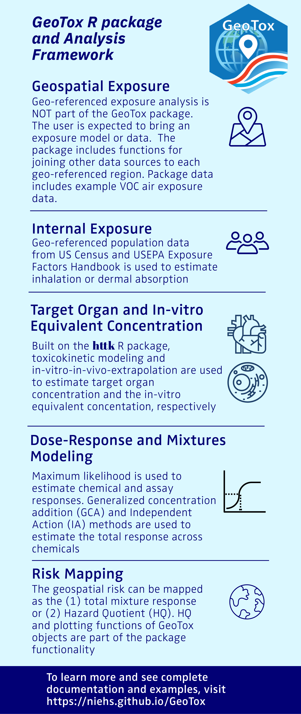

# GeoTox

`GeoTox` open-source R software package for characterizing the risk of
perturbing molecular targets involved in adverse human health outcomes
based on exposure to spatially-referenced stressor mixtures via the
GeoTox framework - otherwise known as source-to-outcome-continuum
modeling. The package, methods, and case-studies are described in
[Messier, Reif, and Marvel, 2025, Human
Genomics](https://doi.org/10.1186/s40246-024-00711-8).

The GeoTox framework was first described in [Eccles et al. A geospatial
modeling approach to quantifying the risk of exposure to environmental
chemical mixtures via a common molecular target. Sci Total Environ. 2023
Jan 10;855:158905.](https://pubmed.ncbi.nlm.nih.gov/36152849/)

## Installation

``` r
install.packages("GeoTox")
```

## Development Version

The development version can be installed from GitHub.

``` r
#install.packages("pak")
pak::pak("NIEHS/GeoTox")
```

## Overview

Figure 1 below shows the steps in the source-to-outcome-continuum or
GeoTox modeling framework that is capable in the `GeoTox` package. blue
text nodes represent an object and green text, rounded nodes represent a
methodology or function required to go from one to the next. The
`GeoTox` package uses R S3 object-oriented programming to create the
**GeoTox** object. The **GeoTox** object is a list that contains all of
the information required to run the analysis including tracking
exposure, assays, dose-response, and geospatial referencing.

  
*Figure 1: Overview of the steps in the GeoTox framework*

## Getting Started

Please refer to the [package website](https://niehs.github.io/GeoTox/)
for a detailed description of how to use `GeoTox`.

## Citation

For citation information, please refer to our [CITATION
file](https://github.com/NIEHS/GeoTox/inst/CITATION).

## Issues and Contributions

To add or edit functionality, open a pull request into the main branch
with a detailed description of the proposed changes. Pull requests must
pass all status checks, and then will be approved or rejected by the
GeoTox maintainers.

Utilize [GitHub issues](https://github.com/NIEHS/GeoTox/issues) to
notify the authors of bugs, questions, or recommendations. Identify each
issue with the appropriate label to help ensure a timely response.
