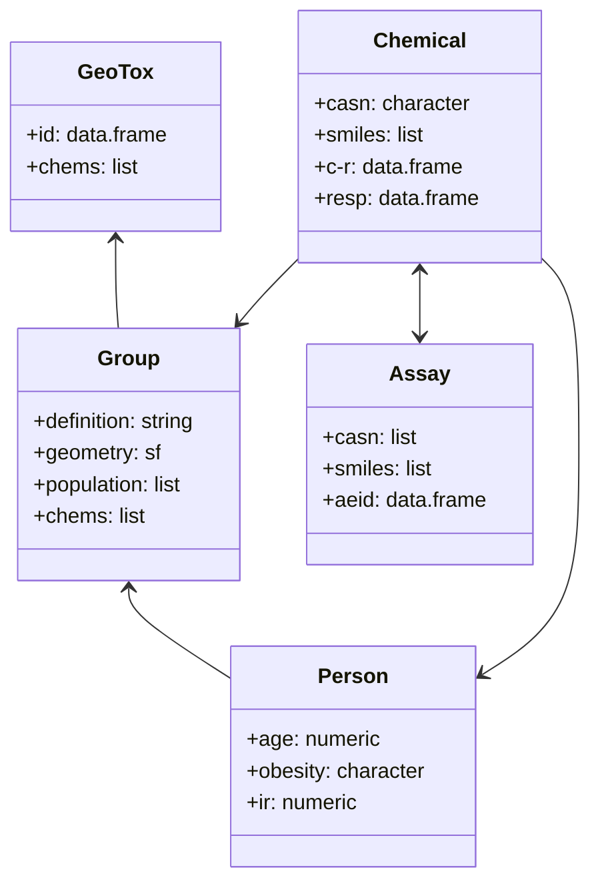

## Proposed Objects and Methods

## NOTES
- Person method using httk to generate C_ss
- Person method fetch Chemical.params to compute risk
-  Region method input chemical_info to set its Person's C_ext values
