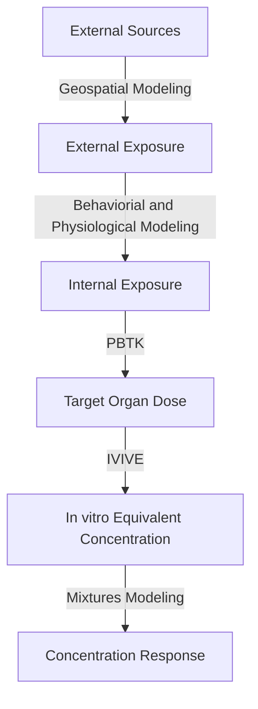
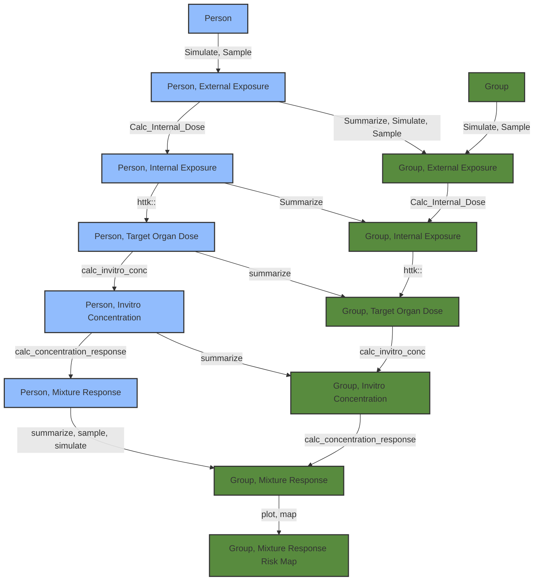

## High-Level Pipeline

```mermaid
graph TB;
    A[External Sources] --> |Geospatial Modeling| B[External Exposure];
    B[External Exposure] --> |Behaviorial and Physiological Modeling| C[Internal Exposure];
    C[Internal Exposure] --> |PBTK| D[Target Organ Dose];
    D[Target Organ Dose] --> |IVIVE| E[In vitro Equivalent Concentration];
    E[In vitro Equivalent Concentration] --> |Mixtures Modeling| F[Concentration Response];
   
```

## Package Object Pipeline

- Nodes are objects/classes
- Edges are methods

```mermaid

graph TB;

    style P1 fill:#91bcfd , stroke:#333, stroke-width:2px, rounded:true;
    style P2 fill:#91bcfd , stroke:#333, stroke-width:2px, rounded:true;
    style P3 fill:#91bcfd , stroke:#333, stroke-width:2px, rounded:true;
    style P4 fill:#91bcfd , stroke:#333, stroke-width:2px, rounded:true;
    style P5 fill:#91bcfd , stroke:#333, stroke-width:2px, rounded:true;
    style P6 fill:#91bcfd , stroke:#333, stroke-width:2px, rounded:true;

    style G1 fill:#588b3e, stroke:#333, stroke-width:2px, rounded:true;
    style G2 fill:#588b3e, stroke:#333, stroke-width:2px, rounded:true;
    style G3 fill:#588b3e, stroke:#333, stroke-width:2px, rounded:true;
    style G4 fill:#588b3e, stroke:#333, stroke-width:2px, rounded:true;
    style G5 fill:#588b3e, stroke:#333, stroke-width:2px, rounded:true;
    style G6 fill:#588b3e, stroke:#333, stroke-width:2px, rounded:true;
    style G7 fill:#588b3e, stroke:#333, stroke-width:2px, rounded:true;


    P1[Person] --> |Simulate, Sample| P2[Person, External Exposure];
    G1[Group] --> |Simulate, Sample| G2[Group, External Exposure];
    P2[Person, External Exposure] --> |Summarize, Simulate, Sample| G2[Group, External Exposure];
    P2[Person, External Exposure] --> |Calc_Internal_Dose| P3[Person, Internal Exposure];
    P3[Person, Internal Exposure] --> |Summarize| G3[Group, Internal Exposure];
    G2[Group, External Exposure] --> |Calc_Internal_Dose| G3[Group, Internal Exposure];
    P3[Person, Internal Exposure] --> |httk::| P4[Person, Target Organ Dose];
    G3[Group, Internal Exposure]--> |httk::| G4[Group, Target Organ Dose];
    P4[Person, Target Organ Dose] --> |summarize| G4[Group, Target Organ Dose];
    P4[Person, Target Organ Dose] --> |calc_invitro_conc| P5[Person, Invitro Concentration];
    G4[Group, Target Organ Dose]--> |calc_invitro_conc| G5[Group, Invitro Concentration];
    P5[Person, Invitro Concentration] --> |summarize| G5[Group, Invitro Concentration];
    P5[Person, Invitro Concentration] --> |calc_concentration_response| P6[Person, Mixture Response];
    G5[Group, Invitro Concentration]--> |calc_concentration_response| G6[Group, Mixture Response];
    P6[Person, Mixture Response]--> |summarize, sample, simulate| G6[Group, Mixture Response];
    G6[Group, Mixture Response]--> |plot, map| G7[Group, Mixture Response Risk Map];

   
```
