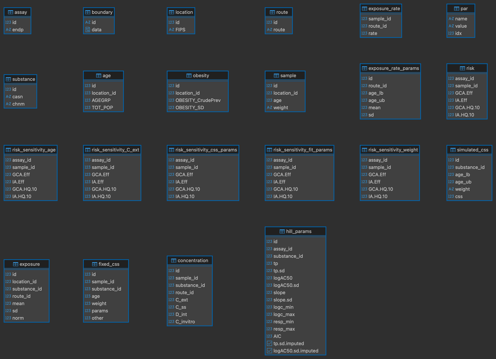

```{r knitr, include = FALSE}
knitr::opts_chunk$set(
  collapse = TRUE,
  comment = "#>"
)
```

This vignette covers basic use of package functions. Package data, `geo_tox_data`, is used throughout the examples and details on how it was created can be found in the "GeoTox Package Data" vignette.

```{r setup, message=FALSE}
library(GeoTox)
library(dplyr)
library(ggplot2)
library(purrr)
library(sf)
library(tibble)
library(tidyr)
```

## Data prep

```{r data-prep}
# Load GeoTox dataset
data("geo_tox_data", package = "GeoTox")

# Reshape C_ss data
css_df <- geo_tox_data$simulated_css |>
  map(\(x) {
    x |>
      mutate(
        age_lb = map_int(age_group, first),
        age_ub = map_int(age_group, last)
      ) |>
      select(age_lb, age_ub, weight, css) |>
      unnest(css)
  }) |>
  enframe(name = "casn") |>
  unnest(value)

# Fit hill model to dose-response data, group by assay and substance
hill_params <- geo_tox_data$dose_response |>
  fit_hill(assay = "endp", substance = c("casn", "chnm"))
# Remove fits that had imputed standard deviations
hill_params$fit <- hill_params$fit |>
  filter(!tp.sd.imputed, !logAC50.sd.imputed)
```

## Workflow steps

Create GeoTox object, run simulations and computations

```{r single-assay-analysis}
set.seed(2357)
GT <- GeoTox("GeoTox-introduction.duckdb") |>
  # Add various data components
  set_boundary(geo_tox_data$boundaries) |>
  set_simulated_css(css_df) |>
  add_exposure_rate_params() |>
  add_hill_params(hill_params) |>
  # Simulate population characteristics and exposure
  simulate_population(
    age       = geo_tox_data$age,
    obesity   = geo_tox_data$obesity,
    exposure  = geo_tox_data$exposure |> mutate(route = "inhalation"),
    substance = c("casn", "chnm"),
    n         = 150
  ) |> 
  # Calculate risk scores
  calc_response() |> 
  # Perform sensitivity analysis
  sensitivity_analysis()
```

## Results

### Print

```{r print}
GT
```

### Tables

```{r tables}
con <- get_con(GT)
DBI::dbListTables(con)
DBI::dbDisconnect(con)
```

```{r table-png, out.width="70%", fig.align="center", echo=FALSE}

```

### Visualize

#### Exposure

```{r plot_exposure, fig.width=8, fig.height=4, out.width="90%", fig.align="center"}
plot_exposure <- function(GT) {
  con <- get_con(GT)
  withr::defer(DBI::dbDisconnect(con))

  boundary <- GT |> get_boundary() |> deframe()

  tbl(con, "exposure") |>
    left_join(tbl(con, "substance"), by = join_by(substance_id == id)) |>
    collect() |>
    left_join(boundary$county, by = join_by(location_id)) |>
    sf::st_as_sf() |>
    ggplot() +
    geom_sf(aes(fill = norm), color = "grey70") +
    facet_wrap(vars(chnm)) +
    geom_sf(data = boundary$state, fill = NA, color = "black") +
    scale_fill_viridis_c(transform = "sqrt") +
    theme(
      axis.text = element_text(size = 5),
      strip.text = element_text(size = 5)
    ) +
    ggtitle("Normalized mean exposure")
}

plot_exposure(GT)
```

#### Concentrations

```{r plot_conc, fig.width=8, fig.height=4, out.width="90%", fig.align="center"}
plot_concentration_mean <- function(GT, col, wrap_var = "chnm") {
  con <- get_con(GT)
  withr::defer(DBI::dbDisconnect(con))

  boundary <- GT |> get_boundary() |> deframe()

  # Substance data for joining chemical names
  substance_df <- tbl(con, "substance") |> collect()

  df <- get_concentration_mean(GT, col) |>
    mutate(mean = if_else(mean == 0, NA, mean)) |>
    left_join(substance_df, by = join_by(substance_id == id)) |>
    left_join(boundary$county, by = join_by(location_id)) |>
    sf::st_as_sf()

  df |>
    ggplot() +
    geom_sf(aes(fill = mean), color = "grey70") +
    facet_wrap(vars(.data[[wrap_var]])) +
    geom_sf(data = boundary$state, fill = NA, color = "black") +
    scale_fill_viridis_c(
      transform = "log10",
      na.value = "grey90"
    ) +
    theme(
      axis.text = element_blank(),
      axis.ticks = element_blank(),
      panel.background = element_blank(),
      panel.grid = element_blank(),
      strip.text = element_text(size = 5)
    ) +
    ggtitle(paste("Mean", col))
}

plot_concentration_mean(GT, "C_ext")
plot_concentration_mean(GT, "C_ss")
plot_concentration_mean(GT, "D_int")
plot_concentration_mean(GT, "C_invitro")
```

#### Risk

```{r plot_risk, fig.width=8, fig.height=3, out.width="90%", fig.align="center"}
plot_risk_quantile <- function(
    GT, col, wrap_var = "endp", quantiles = c("Median" = 0.5)
) {
  con <- get_con(GT)
  withr::defer(DBI::dbDisconnect(con))

  boundary <- GT |> get_boundary() |> deframe()

  # Assay data for joining assay names
  assay_df <- tbl(con, "assay") |> collect()

  df <- get_risk_quantiles(GT, col, quantiles) |>
    left_join(assay_df, by = join_by(assay_id == id)) |>
    left_join(boundary$county, by = join_by(location_id)) |>
    sf::st_as_sf()

  df |>
    ggplot() +
    geom_sf(aes(fill = value), color = "grey70") +
    facet_wrap(vars(.data[[wrap_var]])) +
    geom_sf(data = boundary$state, fill = NA, color = "black") +
    scale_fill_viridis_c(
      limits = c(0, max(df$value, na.rm = TRUE)),
      direction = -1,
      option = "A",
      transform = "sqrt",
      na.value = "grey90"
    ) +
    theme(
      axis.text = element_blank(),
      axis.ticks = element_blank(),
      panel.background = element_blank(),
      panel.grid = element_blank(),
      strip.text = element_text(size = 5)
    ) +
    ggtitle(paste(names(quantiles), col))
}

plot_risk_quantile(GT, "GCA.Eff")
plot_risk_quantile(GT, "IA.Eff")
plot_risk_quantile(GT, "GCA.HQ.10")
plot_risk_quantile(GT, "IA.HQ.10")
```

#### Sensitivity

```{r plot_sens, fig.width=8, fig.height=3, out.width="90%", fig.align="center"}
plot_risk_sensitivity <- function(GT, metric, assay) {
  df <- get_risk_sensitivity(GT, metric, assay) |> 
    rename(all_of(c(
      "External Concentration"   = "C_ext",
      "Toxicokinetic Parameters" = "css_params",
      "Weight"                   = "weight",
      "Age"                      = "age",
      "Concentration-Response"   = "fit_params",
      "Baseline"                 = "baseline"
    )))
  df <- df |>
    pivot_longer(cols = everything()) |>
    mutate(name = factor(name, levels = names(df)))

  idx <- is.na(df$value)
  if (any(idx)) {
    warning("Removed ", sum(idx), " NA from risk sensitivity data.",
            call. = FALSE)
    df <- df |> filter(!idx)
  }
  if (nrow(df) == 0) {
    stop("No risk sensitivity data to plot.", call. = FALSE)
  }
  ggplot(df, aes(x = value, y = 0, color = name)) +
    ggridges::stat_density_ridges(
      calc_ecdf = TRUE,
      quantiles = 4,
      quantile_lines = FALSE,
      fill = NA,
      linewidth = 1
    ) +
    scale_x_log10(guide = "axis_logticks") +
    scale_color_brewer(palette = "Set2") +
    labs(x = metric, y = "", title = assay, color = 'Varying Parameter') +
    theme_minimal() +
    theme(
      panel.grid.major.y = element_blank(),
      panel.grid.minor.y = element_blank(),
      axis.text.y = element_blank()
    )
}

metric <- "IA.Eff"
assay <- c(endp = "TOX21_ELG1_LUC_Agonist")
plot_risk_sensitivity(GT, metric, assay)
```

```{r remove-file, echo=FALSE, results='hide'}
file.remove(GT$db_info$dbdir)
```
