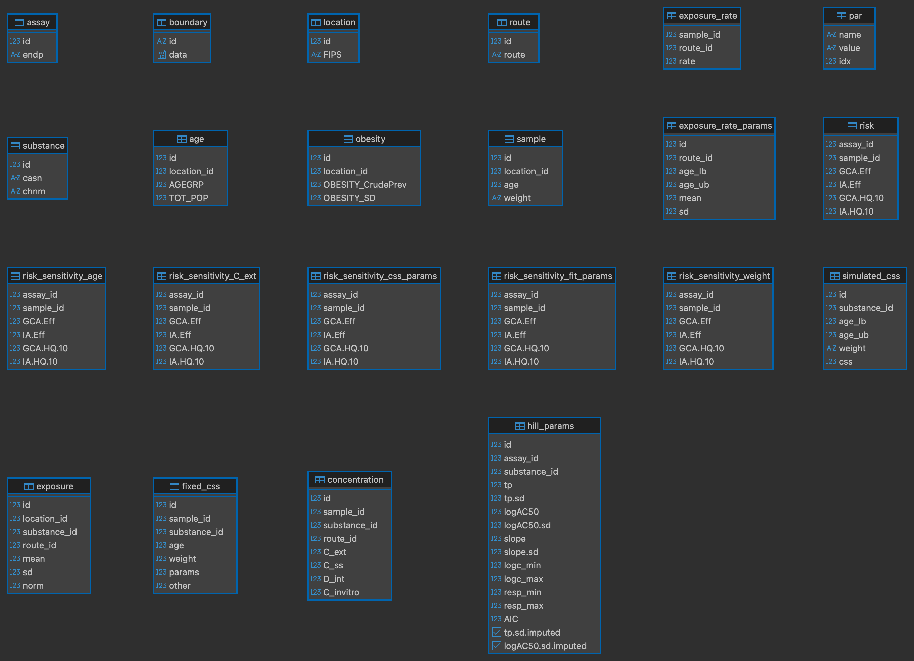

This vignette covers basic use of package functions. Package data, `geo_tox_data`, is used throughout the examples and details on how it was created can be found in the "GeoTox Package Data" vignette.

# Setup

Load packages and set a seed for reproducibility.

```{r}
#| label: setup
#| message: false
library(GeoTox)
library(dplyr)
library(ggplot2)
library(purrr)
library(sf)
library(tibble)
library(tidyr)

set.seed(2357)
```

# Hill curve fitting

Hill curve fitting is a key step in the GeoTox workflow, as it provides the parameters needed to link internal concentrations to assay responses. The `fit_hill()` function can be used to fit Hill models to dose-response data, and the resulting parameters can be added to a GeoTox object for use in subsequent calculations. Dose-reponse data can be grouped by assay and substance to fit separate Hill curves for each combination.

```{r}
#| label: hill-fit
hill_params <- fit_hill(
  geo_tox_data$dose_response,
  assay = "endp",
  substance = c("casn", "chnm")
)
hill_params
```

Sometimes the standard deviation estimates may be missing. In these cases, `fit_hill()` will impute missing standard deviations with the corresponding parameter estimate. If this is not desirable, the imputed standard deviations can be identified using the `tp.sd.imputed` and `logAC50.sd.imputed` columns of the resulting object's `fit` table, and these fits can be removed.

```{r}
#| label: hill-filter
hill_params$fit <- hill_params$fit |>
  filter(!tp.sd.imputed, !logAC50.sd.imputed)
```

The resulting Hill curves can be visualized by plotting the fitted curves along with the original dose-response points.

```{r}
#| label: hill-plot
#| out-width: 100%
ggplot() +
  # Add original dose-response points
  geom_point(
    data = geo_tox_data$dose_response |>
      semi_join(hill_params$fit, by = c("endp", "chnm")),
    aes(x = 10^logc, y = resp),
    pch = 1,
    size = 0.5
  ) +
  # Add Hill curves
  pmap(
    hill_params$fit |> select(endp, chnm, tp, logAC50, slope),
    \(endp, chnm, tp, logAC50, slope) {
      geom_function(
        data = tibble(endp = endp, chnm = chnm),
        fun = \(x, tp, logAC50, slope) {
          tp / (1 + (10^logAC50 / x)^slope)
        },
        args = list(tp = tp, logAC50 = logAC50, slope = slope),
        color = "red"
      )
    }
  ) +
  # Format
  facet_grid(endp ~ chnm, scales = "free_y") +
  scale_x_log10(
    limits = c(1e-4, 1e4),
    labels = scales::label_log()
  ) +
  theme(
    axis.title = element_blank(),
    axis.text = element_text(size = 5),
    strip.text = element_text(size = 5)
  )
```

# Workflow steps

There are three main steps to the GeoTox workflow: creating a GeoTox object and setting various data components, simulating population characteristics and exposure, and calculating risk scores.

## Create a GeoTox object

Creating a GeoTox object requires providing a path to a DuckDB database file. This can be an existing file or a new file that will be created. There are several components that can be set once the object is created.

* `set_boundary()`: (optional) Store spatial boundary data as a `BLOB` in the database. The boundary data can be retrieved later using `get_boundary()` and used for visualization.
* `set_simulated_css()`: Store pre-simulated steady-state plasma concentration data as a table in the database. These values are used by `sample_simulated_css()` (or the wrapper function `simulate_population()`).
* `add_exposure_rate_params()`: Add parameters needed to simulate exposure rates for specific routes, e.g. inhalation. These parameters are used by `simulate_exposure_rate()` (or the wrapper function `simulate_population()`).
* `add_hill_params()`: Add parameters from Hill curve fitting to the database. These parameters are used by `calc_risk()` (or the wrapper function `calc_response()`).

```{r}
#| label: workflow-create-object
GT <- GeoTox("GeoTox-introduction.duckdb") |>
  set_boundary(geo_tox_data$boundaries) |>
  set_simulated_css(geo_tox_data$simulated_css) |>
  add_exposure_rate_params() |>
  add_hill_params(hill_params)
```

## Simulate a population

Population characteristics (age and obesity status) and exposure can be simulated using the `simulate_population()` function, which is a wrapper around `simulate_age()`, `simulate_obesity()`, `simulate_exposure_rate()`, and `simulate_exposure()`. Alternatively, `set_sample()` can be used for age and/or obesity status. The resulting simulated data is stored in the database and used for subsequent calculations. In addition, `simulate_population()` will sample steady-state plasma concentrations from the pre-simulated data using `sample_simulated_css()`, and `set_fixed_css()` will be called in preparation for sensitivity analysis.

```{r}
#| label: workflow-simulate
GT <- GT |> 
  simulate_population(
    age       = geo_tox_data$age,
    obesity   = geo_tox_data$obesity,
    exposure  = geo_tox_data$exposure |> mutate(route = "inhalation"),
    substance = c("casn", "chnm"),
    n         = 150
  )
```

## Calculate risk

Risk scores can be calculated using the `calc_response()` function, which is a wrapper around `calc_internal_dose()`, `calc_invitro_concentration()`, and `calc_risk()`. Sensitivity analysis can then be performed using `sensitivity_analysis()`.

```{r}
#| label: workflow-calc-risk
GT <- GT |> 
  calc_response() |> 
  sensitivity_analysis()
```

# Results

An overview of the GeoTox object can be obtained by printing it.

```{r}
#| label: print
GT
```

Connecting to the database allows access to the various tables that store the data used in the workflow.

```{r}
#| label: tables
con <- get_con(GT)
DBI::dbListTables(con)
DBI::dbDisconnect(con)
```

Below are the tables that exist after performing sensitivity analysis on the example dataset.

```{r}
#| label: table-png
#| out.width: "70%"
#| fig.align: "center"
#| echo: false

```

There are several helper functions for fetching data from the database for use in visualization. Geographical boundary data can be retrieved using `get_boundary()` and combined with these other helper functions for plotting.

## Exposure

Exposure data was added to the database using `simulate_population()`, which calls `add_exposure()` and `simulate_exposure()`. The input data used to simulate exposure values is stored in the `exposure` table and can be joined with the `substance` table to retrieve any entered chemical information. Below is an example of plotting the normalized mean exposure by county and chemical name.

```{r}
#| label: plot_exposure
#| fig.width: 8
#| fig.height: 4
#| out.width: "90%"
#| fig.align: "center"
plot_exposure <- function(GT) {
  con <- get_con(GT)
  withr::defer(DBI::dbDisconnect(con))

  boundary <- GT |> get_boundary() |> deframe()

  df <- tbl(con, "exposure") |>
    left_join(tbl(con, "substance"), by = join_by(substance_id == id)) |>
    collect() |>
    left_join(boundary$county, by = join_by(location_id)) |>
    sf::st_as_sf()

  ggplot(df) +
    geom_sf(aes(fill = norm), color = "grey70") +
    facet_wrap(vars(chnm)) +
    geom_sf(data = boundary$state, fill = NA, color = "black") +
    scale_fill_viridis_c(transform = "sqrt") +
    theme(
      axis.text = element_text(size = 5),
      strip.text = element_text(size = 5)
    ) +
    ggtitle("Normalized mean exposure")
}

plot_exposure(GT)
```

## Concentrations

Various concentration fields are stored in the `concentration` table. The helper function `get_concentration_mean()` can be used to fetch the mean values for a given concentration field, grouped by substance, route, and location. The concentration data can then be plotted similarly to the exposure data. Below are examples of plotting the mean external concentration (`C_ext`), steady-state plasma concentration (`C_ss`), internal dose (`D_int`), and _in vitro_ concentration (`C_invitro`) by county and chemical name.

```{r}
#| label: plot_conc
#| fig.width: 8
#| fig.height: 4
#| out.width: "90%"
#| fig.align: "center"
plot_concentration_mean <- function(GT, col, wrap_var = "chnm") {
  con <- get_con(GT)
  withr::defer(DBI::dbDisconnect(con))

  boundary <- GT |> get_boundary() |> deframe()

  # Substance data for joining chemical names
  substance_df <- tbl(con, "substance") |> collect()

  df <- get_concentration_mean(GT, col) |>
    mutate(mean = if_else(mean == 0, NA, mean)) |>
    left_join(substance_df, by = join_by(substance_id == id)) |>
    left_join(boundary$county, by = join_by(location_id)) |>
    sf::st_as_sf()

  ggplot(df) +
    geom_sf(aes(fill = mean), color = "grey70") +
    facet_wrap(vars(.data[[wrap_var]])) +
    geom_sf(data = boundary$state, fill = NA, color = "black") +
    scale_fill_viridis_c(
      transform = "log10",
      na.value = "grey90"
    ) +
    theme(
      axis.text = element_blank(),
      axis.ticks = element_blank(),
      panel.background = element_blank(),
      panel.grid = element_blank(),
      strip.text = element_text(size = 5)
    ) +
    ggtitle(paste("Mean", col))
}

plot_concentration_mean(GT, "C_ext")
plot_concentration_mean(GT, "C_ss")
plot_concentration_mean(GT, "D_int")
plot_concentration_mean(GT, "C_invitro")
```

## Risk

Several risk metrics are stored in the `risk` table. The helper function `get_risk_quantiles()` can be used to fetch quantiles of these risk metrics grouped by assay and location. Below are examples of plotting the median values for the generalized concentration addition (GCA) and independent action (IA) efficacy risk scores and the hazard quotients using the 10% effective concentration (HQ.10).

```{r}
#| label: plot_risk
#| fig.width: 8
#| fig.height: 3
#| out.width: "90%"
#| fig.align: "center"
plot_risk_quantile <- function(
    GT, col, wrap_var = "endp", quantiles = c("Median" = 0.5)
) {
  con <- get_con(GT)
  withr::defer(DBI::dbDisconnect(con))

  boundary <- GT |> get_boundary() |> deframe()

  # Assay data for joining assay names
  assay_df <- tbl(con, "assay") |> collect()

  df <- get_risk_quantiles(GT, col, quantiles) |>
    left_join(assay_df, by = join_by(assay_id == id)) |>
    left_join(boundary$county, by = join_by(location_id)) |>
    sf::st_as_sf()

  ggplot(df) +
    geom_sf(aes(fill = value), color = "grey70") +
    facet_wrap(vars(.data[[wrap_var]])) +
    geom_sf(data = boundary$state, fill = NA, color = "black") +
    scale_fill_viridis_c(
      limits = c(0, max(df$value, na.rm = TRUE)),
      direction = -1,
      option = "A",
      transform = "sqrt",
      na.value = "grey90"
    ) +
    theme(
      axis.text = element_blank(),
      axis.ticks = element_blank(),
      panel.background = element_blank(),
      panel.grid = element_blank(),
      strip.text = element_text(size = 5)
    ) +
    ggtitle(paste(names(quantiles), col))
}

plot_risk_quantile(GT, "GCA.Eff")
plot_risk_quantile(GT, "IA.Eff")
plot_risk_quantile(GT, "GCA.HQ.10")
plot_risk_quantile(GT, "IA.HQ.10")
```

## Sensitivity

Results from sensitivity analyses are stored in the `risk_sensitivity_*` tables. The helper function `get_risk_sensitivity()` is a wrapper around `get_risk_values()`, which can be used to fetch sensitivity data for a given risk metric, to obtain values for all varying parameters grouped by location for a specific assay. Below is an example of plotting the sensitivity data for the IA efficacy risk score using ridgeline density plots.

```{r}
#| label: plot_sens
#| fig.width: 8
#| fig.height: 3
#| out.width: "90%"
#| fig.align: "center"
plot_risk_sensitivity <- function(GT, metric, assay) {
  df <- get_risk_sensitivity(GT, metric, assay) |> 
    rename(all_of(c(
      "External Concentration"   = "C_ext",
      "Toxicokinetic Parameters" = "css_params",
      "Weight"                   = "weight",
      "Age"                      = "age",
      "Concentration-Response"   = "fit_params",
      "Baseline"                 = "baseline"
    )))
  df <- df |>
    pivot_longer(cols = everything()) |>
    mutate(name = factor(name, levels = names(df)))

  idx <- is.na(df$value)
  if (any(idx)) {
    warning(
      "Removed ", sum(idx), " NA from risk sensitivity data.", call. = FALSE
    )
    df <- df |> filter(!idx)
  }

  if (nrow(df) == 0) {
    stop("No risk sensitivity data to plot.", call. = FALSE)
  }

  ggplot(df) +
    ggridges::stat_density_ridges(
      aes(x = value, y = 0, color = name),
      calc_ecdf = TRUE,
      quantiles = 4,
      quantile_lines = FALSE,
      fill = NA,
      linewidth = 1
    ) +
    scale_x_log10(guide = "axis_logticks") +
    scale_color_brewer(palette = "Set2") +
    labs(x = metric, y = "", title = assay, color = 'Varying Parameter') +
    theme_minimal() +
    theme(
      panel.grid.major.y = element_blank(),
      panel.grid.minor.y = element_blank(),
      axis.text.y = element_blank()
    )
}

metric <- "IA.Eff"
assay <- c(endp = "TOX21_DT40_LUC")
plot_risk_sensitivity(GT, metric, assay)
```

```{r}
#| label: remove-file
#| echo: false
#| output: false
file.remove(GT$db_info$dbdir)
```
